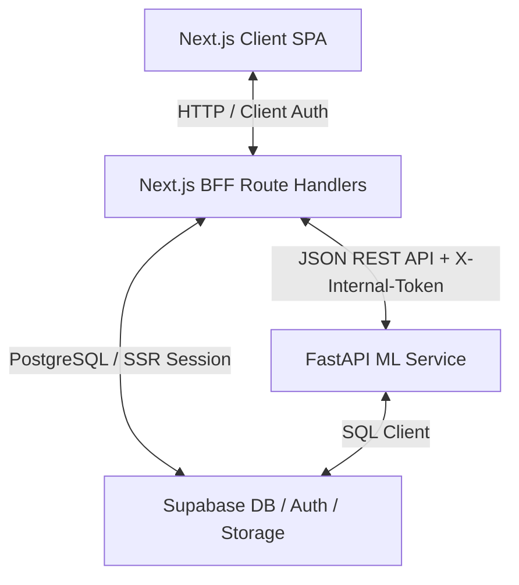

# FAIV Predict — System Architecture & Design Specification

This document details the software architecture, database design, authentication mechanisms, and external integration points of the FAIV Predict platform.

---

## 1. System Architecture Diagram

---

## 2. Component Specifications

### 2.1 Frontend & Next.js BFF Router
- **Framework**: Next.js 14 (App Router, React Server Components & client side fetch).
- **Next.js BFF Routing**: Server-side route handlers under `app/api/` act as an API gateway proxying database reads/writes, ML inference, and authentication state. The browser never talks to the ML service or LLM APIs directly.
- **Authentication Guardrails**:
  - Middleware enforces an active Supabase session for dashboard routes (`/dashboard`, `/predict`, `/calendar`, `/history`, `/niches`, `/model-health`). Unauthenticated requests redirect to `/`.
  - There is no client-side auth bypass. When Supabase environment variables are absent the middleware treats all requests as unauthenticated rather than crashing.

### 2.2 FastAPI Machine Learning Service
- **Hosting**: Python Uvicorn server on port `8000`. All endpoints require the `X-Internal-Token` shared secret when `INTERNAL_API_TOKEN` is configured.
- **Core Operations**:
  - `POST /predict`: extracts the 7 features, loads the personal/niche Random Forest, and returns the predicted tier (`High`/`Average`/`Low`), confidence, class probabilities, MDI feature importances, and the persisted `prediction_id`. Returns `503` when no trained model exists (never a fabricated result).
  - `POST /suggest`: deterministic Template Recommendation Engine — parameter adjustments derived from the request's features vs niche baselines.
  - `POST /train`: queues background retraining (`model_retrain_jobs` row + background task).
  - `GET /train/{job_id}`: real job status from the database (`503` when the database is unavailable).
  - `POST /sync` / `POST /sync/now`: Instagram Graph API data sync + auto-retrain pipeline (n8n orchestration).

### 2.3 Supabase Database & Storage Buckets
- **PostgreSQL Database**: 5 core relational tables (`brands`, `posts`, `predictions`, `models`, `model_retrain_jobs`) — see `supabase_schema.sql`.
- **Row-Level Security (RLS)**: active on tables to prevent unauthorized inserts. Client requests must supply an active auth session JWT (or the service-role key server-side).
- **Storage Buckets**: a private bucket named `models` archives trained model bundles (`.joblib`). Reads/writes are authorized via the `SUPABASE_KEY` (service-role token).

---

## 3. External Integrations
- **Meta Graph API** — Instagram credentials are loaded from environment variables on the ML service:
  - Bison Gym feed: `BISON_PAGE_ACCESS_TOKEN` / `BISON_INSTAGRAM_ID`.
  - Lasence Bakeshop feed: `LASENCE_PAGE_ACCESS_TOKEN` / `LASENCE_INSTAGRAM_ID`.
- **Google Gemini** (`LLM_API_KEY`, optional) — powers the AI brand classifier (`/api/classify`) and AI caption refinement (`/api/refine-caption`). Both endpoints return `501` when unconfigured; the UI falls back to manual selection / hides the feature.
- **n8n** — `n8n/workflow_sync_retrain.json` schedules the weekly sync + retrain run against `POST /sync/now` and emails the outcome.

---

## 4. Test Credentials
Pre-filled on the login form for development and testing. They authenticate against the real Supabase Auth project — no mock session is created.
- **Email**: `wincentcoleusphan@gmail.com`
- **Password**: `skripsisuccess`
