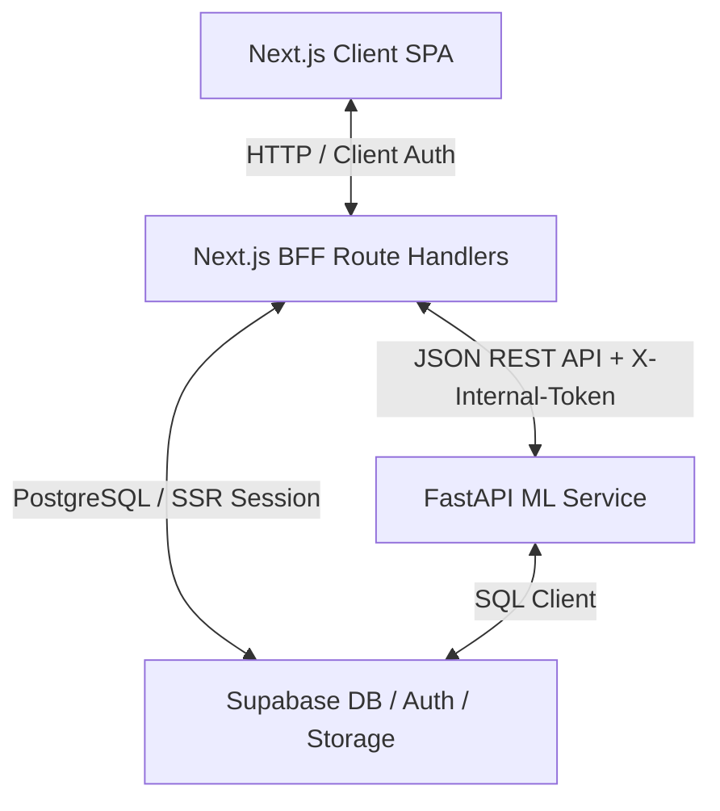

# FAIV Predict — System Architecture & Design Specification

This document details the software architecture, database design, authentication mechanisms, and external integration points of the FAIV Predict platform.

---

## 1. System Architecture Diagram

---

## 2. Component Specifications

### 2.1 Frontend & Next.js BFF Router
- **Framework**: Next.js 15 + React 19 (App Router, React Server Components, and client-side fetch).
- **Next.js BFF Routing**: Server-side route handlers under `app/api/` act as an API gateway proxying database reads/writes, ML inference, and authentication state. The browser never talks to the ML service or LLM APIs directly.
- **Authentication Guardrails**:
  - Middleware enforces an active Supabase session for dashboard routes (`/dashboard`, `/predict`, `/calendar`, `/history`, `/insights`, `/niches`). Unauthenticated requests redirect to `/`.
  - There is no client-side auth bypass. When Supabase environment variables are absent the middleware treats all requests as unauthenticated rather than crashing.

### 2.2 FastAPI Machine Learning Service
- **Hosting**: Python Uvicorn server on port `8000`. All endpoints require the `X-Internal-Token` shared secret when `INTERNAL_API_TOKEN` is configured.
- **Core Operations**:
  - `POST /predict`: extracts the 10 deterministic features, loads the personal/cohort Random Forest, and returns the predicted tier (`High`/`Average`/`Low`), confidence, class probabilities, feature importances, OOD signals, measured counterfactuals, and the persisted `prediction_id`. Returns `503` when no trained model exists.
  - `POST /train`: queues background retraining (`model_retrain_jobs` row + background task).
  - `GET /train/{job_id}`: real job status from the database (`503` when the database is unavailable).
  - `POST /sync/now`: Instagram Graph API data sync + auto-retrain pipeline (n8n orchestration).

### 2.3 Supabase Database & Storage Buckets
- **PostgreSQL Database**: six core relational tables (`brands`, `posts`, `predictions`, `models`, `model_retrain_jobs`, `calendar_entries`) — see `supabase_schema.sql`.
- **Row-Level Security (RLS)**: `brands.owner_id` scopes every dependent record. Browser and BFF queries fail closed when ownership cannot be verified.
- **Prediction provenance**: new predictions store `created_by`. Legacy rows without this field remain available for administrator audit but are excluded from History and Dashboard.
- **Published-post provenance**: verified sync rows store immutable `instagram_media_id`, `source = instagram_graph`, and `synced_at`. Legacy rows without that lineage are excluded from training, maturity counts, and Insights baselines. Sync performs idempotent upserts and never clears post history.
- **Model provenance**: new bundles and `models.metrics` record their verified source and identity key. Serving, RLS, Dashboard, and model lists reject pre-migration artifacts that cannot prove they were trained exclusively on media-ID-verified Graph rows.
- **Storage Buckets**: a private bucket named `models` archives trained model bundles (`.joblib`). Reads/writes are authorized via the `SUPABASE_KEY` (service-role token).

---

## 3. External Integrations
- **Meta Graph API** — Instagram Business connections are loaded from the server-only `IG_BRANDS_JSON` configuration and bound to immutable database `brand_id` values. The sync pipeline never creates brands, and the application never stores tokens in client code.
- **Google Gemini** (`LLM_API_KEY`, optional) — powers the AI brand classifier (`/api/classify`) and AI caption refinement (`/api/refine-caption`). Both endpoints return `501` when unconfigured; the UI falls back to manual selection / hides the feature.
- **n8n** — `n8n/workflow_sync_retrain.json` schedules the weekly sync + retrain run against `POST /sync/now` and emails the outcome.

---

## 4. Authentication
The login form never contains credentials. Development accounts must be
provisioned through Supabase Auth and stored only in the developer's local
password manager. Secrets and real account identifiers must not appear in
source code, documentation, fixtures, or screenshots.

---

## 5. Product Scope Decisions

- **Industry taxonomy**: one controlled primary industry cohort per brand. A
  multi-label or embedding taxonomy would fragment the small training set and
  weaken benchmarking. AI is advisory; the user confirms the cohort.
- **Meta onboarding**: username autocomplete before authorization is not used.
  A production self-serve flow must start with Meta authorization, enumerate
  accounts the user can access, validate permissions and Page linkage, then run
  a synchronization test. Until those app credentials and token-storage
  controls are configured, registration creates a disconnected workspace brand
  and states that honestly.
- **Insights**: metrics are loaded lazily for the selected post. Unsupported
  Graph API metrics stay absent. Evidence-based comparisons replace generated
  "AI advice" when the data cannot support a causal recommendation.
- **Optimization advice**: only counterfactuals re-scored by the serving model
  are actionable. The former fixed-hour/caption/hashtag guideline engine was
  removed because those rules were not learned from the selected brand data.
- **Calendar import**: deterministic column detection plus human mapping review
  is the default. LLM parsing is deliberately excluded because spreadsheet
  headers are low-entropy, deterministic matching is auditable, and uploading
  planning documents to an LLM adds privacy, cost, and nondeterminism without a
  measurable thesis benefit.

---

## 6. User-Facing Data Lineage

| Surface | Displayed data | Authoritative origin |
| --- | --- | --- |
| Dashboard | Prediction counts, tiers, confidence, recent rows | `predictions` filtered by owned `brand_id` **and** `created_by = auth.uid()`; model scopes come from RLS-filtered `models` |
| Prediction History | Draft, tier, confidence, verified predicted/actual result | Same authenticated-user prediction query; legacy rows with null creator provenance and outcomes without `actual_source = instagram_media_id` are quarantined |
| Calendar | Planned content and workflow metadata | `calendar_entries` filtered by `owner_id`; `source` is only `manual` or reviewed `import` |
| Published Insights | Media, likes, comments, supported lifetime metrics | Live Instagram Graph API for the selected owned `brand_id`; historical medians use only media-ID-verified `posts`; the read-only prediction trace states its exact-caption match method |
| Brands & Cohorts | Workspace brands, verified post counts, follower count, model metadata | Owned `brands`, media-ID-verified Graph sync rows, live connection health, and RLS-filtered `models`; unknown followers are null, never synthetic zero |
| Predict Insights | Tier, probabilities, confidence, OOD flags, counterfactuals, MDI | The exact persisted model bundle selected for the owned brand/cohort; no fixed guideline engine remains |

The privileged ML service can write sync/model records, but every browser-facing
read is independently constrained by Supabase RLS and repeated BFF ownership
checks. The committed ownership migration is therefore a required deployment
step, not an optional enhancement.
