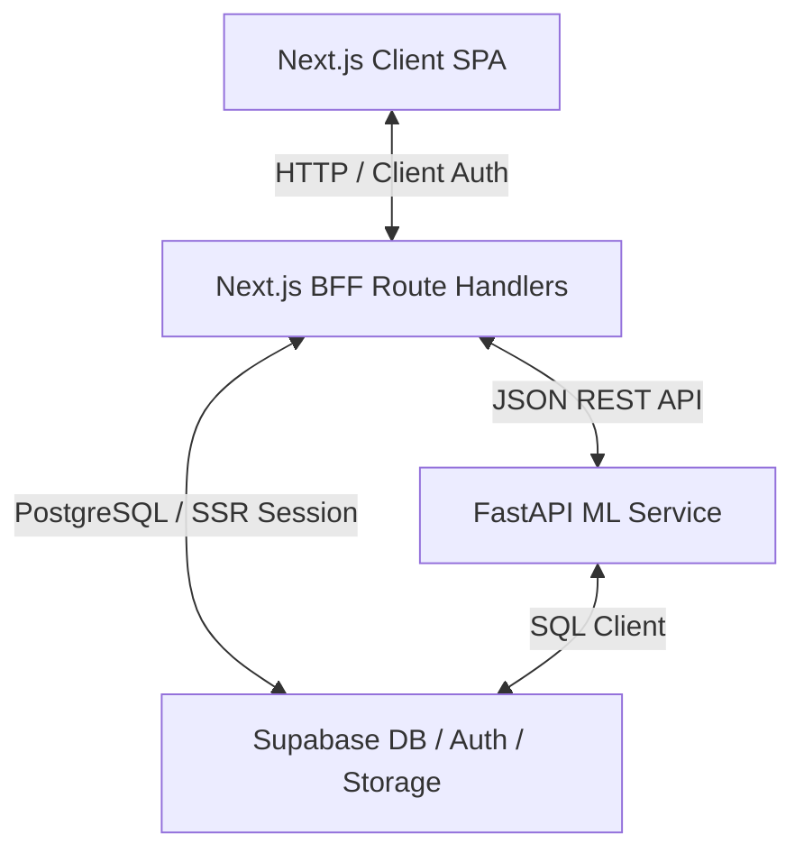

# FAIV Predict — System Architecture & Design Specification

This document details the software architecture, database design, authentication mechanisms, and external integration points of the FAIV Predict platform.

---

## 1. System Architecture Diagram

---

## 2. Component Specifications

### 2.1 Frontend & Next.js BFF Router
- **Framework**: Next.js (App Router, React Server Components & client side fetch).
- **Next.js BFF Routing**: Server-side route handlers under `app/api/` act as an API gateway proxying database reads/writes and authentication states.
- **Authentication Guardrails**:
  - Middleware enforces active sessions for dashboard routes (`/predict`, `/dashboard`, `/niches`, etc.).
  - Auth bypass cookie `sb-simulated-login=true` is supported for local environments when Supabase Auth limits are exceeded.

### 2.2 FastAPI Machine Learning Service
- **Hosting**: Python Uvicorn server running on port `8000`.
- **Core Operations**:
  - `POST /predict`: Receives features JSON (caption, format, posting time, account followers) and returns predicted tier (`HIGH`, `AVERAGE`, `LOW`) and confidence score.
  - `POST /train`: Initiates background model retraining pipelines using `RandomForestClassifier`.
  - `GET /train/status`: Check completion status of retraining jobs.

### 2.3 Supabase Database & Storage Buckets
- **PostgreSQL Database**: Holds 5 core relational tables (`brands`, `posts`, `predictions`, `models`, `model_retrain_jobs`).
- **Row-Level Security (RLS)**: Active on tables to prevent unauthorized inserts. Anonymous read/writes are rejected; client requests must supply an active auth session JWT.
- **Storage Buckets**: A private bucket named `models` is used to archive trained model binary bundles (`.joblib`). Reads/writes to this bucket are authorized via the `SUPABASE_KEY` (service role token).

---

## 3. External Integrations (Meta Graph API)
Instagram/Facebook Graph API credentials are loaded dynamically from environment variables:
- **Bison Gym Feed**: `BISON_PAGE_ACCESS_TOKEN` / `BISON_INSTAGRAM_ID`.
- **Lasence Bakeshop Feed**: `LASENCE_PAGE_ACCESS_TOKEN` / `LASENCE_INSTAGRAM_ID`.

---

## 4. Test Credentials
- **Email**: `wincentcoleusphan@gmail.com`
- **Password**: `skripsisuccess`
