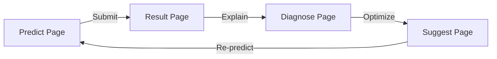

# FAIV Predict — Performance OS for Creative Work

> AI-powered content performance prediction for creative agencies and SMB social media managers. 
> A premium, minimalist SaaS dashboard for forecasting engagement, diagnosing weak signals, and optimizing post configurations before posting.

  

---

## 1. Project Overview & Scope

**FAIV Predict** is a professional Machine Learning dashboard designed to help creators, content strategists, and small brands classify the **performance tier** (`HIGH`, `AVERAGE`, `LOW`) of Instagram posts *before* they publish them. 

### What it is
* **A real-time predictive classifier** powered by a hierarchical Machine Learning model (Random Forest) trained per niche.
* **A calibration workspace** to test parameters (media types, scheduled time, character lengths, hashtag density, and call-to-actions) to see what shapes a post's score.
* **A content intelligence center** with structured heuristics, Mean Decrease in Impurity (MDI) explainability charts, and optional Gemini-based narrative reasoning fallbacks.

### What it is NOT
* **🚫 Not a generative AI copywriter:** It does not automatically generate or rewrite captions.
* **🚫 Not a reach estimator:** It does not predict absolute metrics (e.g., "+15% reach" or "12,400 impressions"). It outputs classification tiers and confidence percentages based on historical niche baselines.

---

## 2. Design System & UX Philosophy

Our UI/UX centers around a **minimalist, productivity-focused, and premium SaaS approach**. Detailed specifications are maintained in [DESIGN.md](./docs/DESIGN.md) and [FAIV_Predict_Design_Documentation.md](./docs/FAIV_Predict_Design_Documentation.md).

### 2.1 Color System (OKLCH Tokens)
We use a curated, HSL/OKLCH color system defined in [globals.css](./frontend/app/globals.css). Hardcoded hex or standard Tailwind values are forbidden.
* **Background (`--background`)**: Near-white with a cool ambient tint (`oklch(0.995 0.002 280)`).
* **Primary (`--primary`)**: Confident brand purple (`oklch(0.55 0.22 290)`) for brand actions, active routes, and `HIGH` tier classification representation.
* **Accent (`--accent-lime`)**: Vibrant lime green (`oklch(0.88 0.20 130)`) representing positive trends, model personalization triggers, and optimal performance states.
* **Warning (`--warning`)**: Warm amber (`oklch(0.78 0.16 75)`) indicating `AVERAGE` tier classification, model cold-start states, and mild alerts.
* **Destructive (`--destructive`)**: Softened crimson (`oklch(0.60 0.18 22)`) indicating `LOW` tier, model concept drift alerts, or error states.

### 2.2 Design Principles
1. **Clarity Over Decoration**: Clean, Notion-inspired borders, softened gradients, and ample whitespace to define layout grids rather than heavy outlines.
2. **Mixed Density Layouts**: Avoid repetitive card grids. Alternating full-bleed hero modules, dense tabular data strips, and borderless rows creates visual rhythm.
3. **Effortless Motion**: Standard transition duration of **180ms ease-out** (`cubic-bezier(0.22, 1, 0.36, 1)`). Interactive elements feature scale-down feedback on click (`active:scale-[0.97]`).
4. **Optimistic & Tactile Feedback**: Metric counters tween, indicators crossfade, and elements update instantly, syncing with underlying APIs in the background.

---

## 3. Information Architecture & Navigation

The platform utilizes a structured navigation sidebar managed in [AppShell.tsx](./frontend/components/AppShell.tsx), dividing flows by user role.

```
┌────────────────────────────────────────────────────────┐
│ App Shell                                              │
│ ┌───────────────┐ ┌──────────────────────────────────┐ │
│ │ Sidebar       │ │ Topbar                           │ │
│ │               │ │ Search (⌘K) | Theme | User profile│ │
│ │ ┌───────────┐ │ ├──────────────────────────────────┤ │
│ │ │ Workspace │ │ Main Page Area                   │ │
│ │ │ Dashboard │ │                                  │ │
│ │ │ Predict   │ │ Mapped Pages & Nested Flows      │ │
│ │ │ Calendar  │ │                                  │ │
│ │ │ History   │ │                                  │ │
│ │ └───────────┘ │ │                                  │ │
│ │ ┌───────────┐ │ │                                  │ │
│ │ │ Admin     │ │                                  │ │
│ │ │ Niches    │ │                                  │ │
│ │ │ M. Health │ │                                  │ │
│ │ └───────────┘ │ │                                  │ │
│ └───────────────┘ └──────────────────────────────────┘ │
└────────────────────────────────────────────────────────┘
```

### 3.1 Layout Structure
* **App Shell**: A fixed 240px wide sidebar on desktop, complete with a collapsible navigation menu, user profile info, and workspace switching.
* **Responsive Drawer**: On tablet and mobile viewports, the sidebar automatically collapses. The topbar displays a hamburger trigger which slides the menu out in a Radix-based drawer/sheet overlay.
* **Global Search (`⌘K`)**: Quick fuzzy search across predictions, registered brands, and active machine learning models.
* **Theme Switching**: Seamless CSS variable transition between Light and Dark modes.

---

## 4. Feature Specifications & Page Flows

### 4.1 Connected Prediction Flow: `Predict → Result → Diagnose → Suggest`
To prevent fractured workspaces and context switching, the core prediction pages are linked linearly. A persistent progress visualizer, [FlowStepper.tsx](./frontend/components/FlowStepper.tsx), sits at the header of each page, maintaining state and direction.



#### 4.1.1 Predict Page
Located at [predict/page.tsx](./frontend/app/(dashboard)/predict/page.tsx). It acts as the composer workspace.
* **Context Selection**: Pick the target account, scheduled posting window, and format.
* **Whitelisted Formats**: Whitelists only **`Reels`**, **`Carousel`**, and **`Single Image`**. *Story is forbidden in the dropdown* to prevent API schema mismatches with FastAPI.
* **DateTimePicker**: Handled in [DateTimePicker.tsx](./frontend/components/DateTimePicker.tsx) using a Radix popover and tactile scroll picker.
* **Caption Intelligence Panel**: Mapped in [CaptionIntel.tsx](./frontend/components/CaptionIntel.tsx), this analyzes text input *instantly* for:
  1. `caption_length` (character length check against Instagram's 2,200 character limit).
  2. `hashtag_count` (total hashtags parsed).
  3. `has_cta` (scans text against a whitelisted CTA keyword regex).
* **Caption Debouncing**: Local character counting and length meter colors update on every keystroke. Downstream prediction updates and tag detections are debounced by **500ms** to prevent flooding FastAPI inference endpoints.

#### 4.1.2 Result Page
Located at [result/page.tsx](./frontend/app/(dashboard)/result/page.tsx).
* **Telemetry Indicators**: Displays the predicted class via [TierBadge.tsx](./frontend/components/TierBadge.tsx) and the confidence percentage in [ConfidenceMeter.tsx](./frontend/components/ConfidenceMeter.tsx) (a circular ring visualizer using tabular-nums).
* **Class Probabilities Bar Chart**: Lists the output likelihood of each class ($P(high)$, $P(average)$, $P(low)$) summing exactly to $1.0$ (100%).
* **Explainability Highlights**: Includes [WhyThisScore.tsx](./frontend/components/WhyThisScore.tsx), highlighting the top-3 feature contributors shaping the score.
* **Loading Skeleton**: Leverages [ResultSkeleton.tsx](./frontend/components/ResultSkeleton.tsx) to match the layout of the final prediction report, preventing cumulative layout shifts (CLS).

#### 4.1.3 Diagnose Page
Located at [diagnose/page.tsx](./frontend/app/(dashboard)/diagnose/page.tsx).
* **Mean Decrease in Impurity (MDI) Chart**: A horizontal Recharts bar chart showing the absolute weights of the 6 features.
* **Guardrails**: Bars are strictly positive numbers summing to 100%. No causal phrasing is used (e.g., "reduces reach by 12%"), and negative bars are prohibited. MDI strictly states *influence magnitude*, not direction.

#### 4.1.4 Suggest Page
Located at [suggest/page.tsx](./frontend/app/(dashboard)/suggest/page.tsx).
* **Template Recommendation Engine (TRE)**: The baseline layer. Generates instant, heuristic recommendations from historical niche baselines (e.g., optimal hashtag counts or posting windows).
* **Optional AI Enrichment**: A *"Perkaya dengan AI"* button triggers a call to Gemini, overlaying narrative reasoning onto the default TRE advice.
* **AI Fallback States**: If Gemini fails, rate-limits, or times out (>8s), the UI displays a `"Standard recommendations"` info badge and continues serving the TRE results. The page remains fully operational.
* **Forbidden Pattern**: Suggest suggestions are strictly parameter-oriented (hour, CTA, length). No reach multipliers (e.g., "+20% reach") are shown, as the Random Forest model cannot output absolute estimates.

---

### 4.2 Content Calendar & Drag-and-Drop Production
Located at [calendar/page.tsx](./frontend/app/(dashboard)/calendar/page.tsx).

* **Interactive Monthly Grid & List Views**: Users can toggle between a traditional grid layout and an audit log table. Cells highlight on hover, and clicking a cell opens a detail creator popover.
* **Drag-and-Drop Excel/CSV Upload**: Supports direct upload of `.xlsx` or `.csv` files.
* **Story Format Skipping**: During validation, rows with `format = "Story"` are flagged as `Skipped (unsupported format)`. They bypass the FastAPI `/predict` call to prevent inference errors.
* **Smart Auto-fill**: If fields are missing in the sheet (e.g., posting time), the local TRE automatically suggests values based on historical niche performance before the batch prediction run begins.
* **Batch Prediction Progress**: Visualizes predictions running in batch with a progress bar and row-by-row status logs (`queued` → `predicting` → `completed` / `skipped` / `error`).
* **Export Diperkaya**: Downloads an enriched `.xlsx` sheet containing original columns alongside model outputs: `predicted_class`, `confidence_score`, `top_feature`, and `tre_recommendation`.

---

### 4.3 Administrator Views & Model Telemetry

#### 4.3.1 Niche & Brand Management
Located at [niches/page.tsx](./frontend/app/(dashboard)/niches/page.tsx).
* **Model Graduation Mechanism**: Shows each brand's sample count. Brands with samples $< 200$ run on the Niche model. Once the account collects $\ge 200$ samples, it graduates to a Personal Model, tracked using [ModelMaturity.tsx](./frontend/components/ModelMaturity.tsx).
* **AI Brand Classifier Dialog**: A modal prompting the administrator for a business description and target audience. Gemini classifies the brand and suggests a matching niche, which the admin can override before finalizing.

#### 4.3.2 Model Health & Concept Drift
Located at [model-health/page.tsx](./frontend/app/(dashboard)/model-health/page.tsx).
* **Concept Drift Badges**:
  * **Stable** (Accuracy drop $\le$ 5pts): Green check badge.
  * **Watch** (Accuracy drop 5–15pts): Amber warning badge.
  * **Drift detected** (Accuracy drop $>$ 15pts): Glowing red alert badge with a pulsing shadow ring (`shadow-glow-destructive`), indicating retraining is required.
* **Retraining Workflows**: Includes a button to trigger a manual model retraining pipeline via GitHub Actions.

---

## 5. Frontend Architecture & Core Implementation Details

As a key component of the thesis platform, the Frontend implements robust patterns for secure communication, adaptive state-based interfaces, and fault-tolerant interactions.

### 5.1 Backend-for-Frontend (BFF) Proxy Flow
To isolate the ML inference layer and manage Supabase authorization tokens securely without exposing endpoint configurations to the client browser, Next.js API Route Handlers under `./frontend/app/api/` act as a secure proxy bridge:

```
┌──────────────┐         POST /api/predict          ┌───────────────────┐         Forward Request         ┌──────────────────┐
│ Client (Web) │ ─────────────────────────────────> │ Next.js API Route │ ──────────────────────────────> │ FastAPI ML Engine│
│              │ <───────────────────────────────── │ (BFF Proxy)       │ <────────────────────────────── │ (Private Subnet) │
└──────────────┘         JSON Response              └───────────────────┘         Bearer JWT Token        └──────────────────┘
                                                              │
                                                      Extracts Session from
                                                     sb-access-token Cookie
```

1. **Session Capturing**: The frontend client logs in via Supabase Auth, which sets session credentials in cookies (`sb-access-token` / `sb-refresh-token`).
2. **Server-Side Interception**: When a client triggers `/api/predict` or `/api/suggest`, Next.js Route Handlers load the cookie store using server-side headers (`cookies()`).
3. **Authorization Wrapping**: Next.js parses the cookies to extract the active JWT token, appends it as a `Bearer` token inside the outgoing `Authorization` header, and strips any client-side CORS headers.
4. **Secure Proxying**: The Next.js BFF forwards the request to the FastAPI inference engine (`process.env.FASTAPI_URL`), keeping the internal ML backend secure from public access. The JSON response is then safely returned to the client UI.

### 5.2 Model Maturity Conditional Rendering Logic
The UI implements an adaptive, sample-based state layout triggered by brand account graduation milestones. This is implemented using `./frontend/components/ModelMaturity.tsx` and parent views:

* **Maturity Calculation**: Account model maturity is evaluated dynamically:
  $$\text{maturityState} = \begin{cases} 
  \text{low} & \text{if } n < 100 \\ 
  \text{learning} & \text{if } 100 \le n < 200 \\ 
  \text{personal} & \text{if } n \ge 200 
  \end{cases}$$
* **Visual States**:
  * **Low Confidence** (Amber warning badge, $\le 50\%$ progress bar): Warns the user that predictions rely on broad niche baselines and have higher error margins.
  * **Learning** (Purple primary badge, progress towards 200): Displays learning metrics showing active compilation progress.
  * **Personal Model Active** (Lime accent, glow effect): Signals that the brand-specific personal model is live, bypassing Niche averages for tailored predictions.
* **Layout Switches**: Parent components conditionally switch layouts based on the model tier flag in the response metadata (`is_personal_model_active`):
  * **Niche Fallback Model**: Displays comparison callouts contrasting the brand draft against broad niche guidelines (e.g., `@nova.studio` vs Fashion Niche Average).
  * **Account-Specific Dedicated Model**: Displays specialized performance diagnostics and individual metrics based exclusively on the brand's unique history.

### 5.3 Sandbox-Resilient Clipboard Copying Utility
To enable users to copy suggested captions and tags from the Suggest workspace without causing script crashes in restricted client environments (like iframe-based browser sandboxes, local testing scripts, or older mobile devices), a robust fallback utility is implemented:

```typescript
export async function copyToClipboard(text: string): Promise<boolean> {
  // 1. Primary Modern Approach
  if (navigator.clipboard && typeof navigator.clipboard.writeText === "function") {
    try {
      await navigator.clipboard.writeText(text);
      return true;
    } catch (err) {
      console.warn("navigator.clipboard blocked by permissions/iframe sandbox. Invoking fallback...");
    }
  }

  // 2. Fallback Secondary Approach (Bypasses Sandbox Permission Barriers)
  try {
    const textarea = document.createElement("textarea");
    textarea.value = text;
    
    // Prevent scrolling and position off-screen
    textarea.style.position = "fixed";
    textarea.style.top = "-9999px";
    textarea.style.left = "-9999px";
    
    document.body.appendChild(textarea);
    textarea.focus();
    textarea.select();
    
    const successful = document.execCommand("copy");
    document.body.removeChild(textarea);
    
    if (successful) return true;
  } catch (err) {
    console.error("All copy-to-clipboard actions failed: ", err);
  }
  
  return false;
}
```
This utility prevents sandbox permission blocks, ensuring that automation runners and thesis reviewers can evaluate the copy interactions without encountering browser security exceptions.

---

## 6. System Architecture & Integrations

FAIV Predict is a full-stack Machine Learning system with decoupled components.

```
┌─────────────────┐       HTTPS / JSON       ┌──────────────────┐
│  Next.js (App)  │ ───────────────────────> │ FastAPI (Engine) │
│  Client View    │ <─────────────────────── │ scikit-learn RF  │
└─────────────────┘                          └──────────────────┘
         │                                             │
         │ SQL & Auth                                  │ Model Storage
         ▼                                             ▼
┌─────────────────┐                          ┌──────────────────┐
│ Supabase DB     │                          │ Supabase Bucket  │
│ Auth & Storage  │                          │ Trained Artifacts│
└─────────────────┘                          └──────────────────┘
```

* **Client**: Next.js (App Router, Tailwind CSS, TypeScript, framer-motion, Recharts).
* **Inference Engine**: FastAPI backend hosting Random Forest classifiers per niche.
* **Storage & Auth**: Supabase Postgres for credentials, predictions, and model health stats. Supabase Buckets store trained `.joblib` model binaries.
* **Enrichment API**: Gemini API bridge for brand classification and suggestion rationale.

---

## 7. Interaction Rules & Fail-Safe Telemetry

### 7.1 FastAPI Service Unavailable Fallback (TC-20)
If the FastAPI inference service is unreachable (e.g., cold-start sleep on the free hosting tier), the frontend handles it gracefully:
1. **Global Error Boundary**: Wraps route trees in Next.js, preventing page crashes.
2. **Per-Surface Fallback Cards**: Renders a "Prediction service warming up" alert panel with a `Continue editing` action (keeping inputs intact locally) and an auto-retry button.
3. **Exponential Backoff**: Automates service polling at 1s, 2s, and 4s intervals before surfacing manual recovery actions.

### 7.2 Calendar Story-Skip Logic
To protect inference pipelines:
* Rows matching `format = "Story"` are flagged as `Skipped` prior to serialization.
* Story items are rendered in calendar cells using a muted gray chip, preventing redundant FastAPI request payloads.

---

## 8. Codebase Directory Map

* [frontend/app/page.tsx](./frontend/app/page.tsx) — Main landing page & login panel.
* [frontend/app/(dashboard)/dashboard/page.tsx](./frontend/app/(dashboard)/dashboard/page.tsx) — Landing console containing KPIs, heatmap, and model summary logs.
* [frontend/app/(dashboard)/predict/page.tsx](./frontend/app/(dashboard)/predict/page.tsx) — Composition form.
* [frontend/app/(dashboard)/result/page.tsx](./frontend/app/(dashboard)/result/page.tsx) — Prediction report detailing confidence and probability tiers.
* [frontend/app/(dashboard)/diagnose/page.tsx](./frontend/app/(dashboard)/diagnose/page.tsx) — Feature weight diagnosis.
* [frontend/app/(dashboard)/suggest/page.tsx](./frontend/app/(dashboard)/suggest/page.tsx) — Parameter tuning advice workspace.
* [frontend/app/(dashboard)/calendar/page.tsx](./frontend/app/(dashboard)/calendar/page.tsx) — Interactive spreadsheet and content grid.
* [frontend/app/(dashboard)/model-health/page.tsx](./frontend/app/(dashboard)/model-health/page.tsx) — System telemetry monitor.
* [frontend/app/(dashboard)/niches/page.tsx](./frontend/app/(dashboard)/niches/page.tsx) — Brand classifier interface.
* [frontend/app/(dashboard)/history/page.tsx](./frontend/app/(dashboard)/history/page.tsx) — Auditable prediction logs.

### Reusable UI Elements
* [AppShell.tsx](./frontend/components/AppShell.tsx) — Collapsible layout framework.
* [CaptionIntel.tsx](./frontend/components/CaptionIntel.tsx) — Instant text indicators and character counts.
* [ConfidenceMeter.tsx](./frontend/components/ConfidenceMeter.tsx) — Gauges confidence percentages.
* [DateTimePicker.tsx](./frontend/components/DateTimePicker.tsx) — Tactile schedulers.
* [FlowStepper.tsx](./frontend/components/FlowStepper.tsx) — Flow progress visualizer.
* [ModelMaturity.tsx](./frontend/components/ModelMaturity.tsx) — Progress metric displays.
* [PostingHeatmap.tsx](./frontend/components/PostingHeatmap.tsx) — Grid displaying optimal posting windows.
* [WhyThisScore.tsx](./frontend/components/WhyThisScore.tsx) — Renders text explainability indicators.
* [ResultSkeleton.tsx](./frontend/components/ResultSkeleton.tsx) — Visual placeholder skeletons.
* [TierBadge.tsx](./frontend/components/TierBadge.tsx) — Semantically colored badges.

---

## 9. Getting Started

### 9.1 Prerequisites
Ensure you have `Node.js 18+` and `npm` installed.

### 9.2 Installation
Install dependencies in the frontend workspace:
```bash
cd frontend
npm install
```

### 9.3 Running the Development Server
Fire up the Next.js local environment:
```bash
npm run dev
```
Open [http://localhost:3000](http://localhost:3000) inside your web browser.

---

*Last Updated: 2026-05-28*
