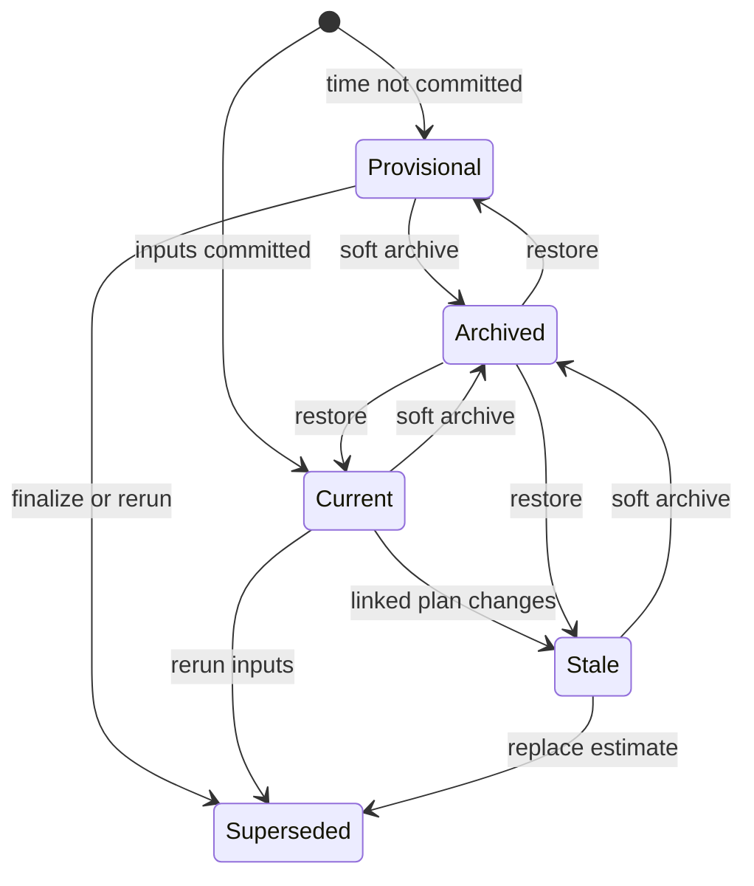
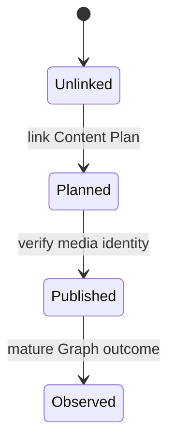

# FAIV Predict defense kit

Status: technical narrative ready. Live token checks, final empirical exports, screenshots, preflight logs, and rehearsals remain operator tasks and must not be claimed until completed.

## One-page architecture story

FAIV Predict is an authenticated decision-support prototype, not an Instagram publisher. A signed-in user prepares a content concept in the Next.js interface. The Next.js backend-for-frontend (BFF) verifies ownership through Supabase and sends only a validated internal request to FastAPI. FastAPI derives ten observable metadata/caption-structure features, loads the newest eligible personal model or niche fallback, and saves an immutable prediction snapshot. Supabase PostgreSQL and private Storage hold tenant data and versioned model artifacts. Meta Graph synchronization supplies verified historical observations; n8n schedules health checks, synchronization, and retraining. Gemini is optional, advisory, and isolated from Random Forest inference.

| Boundary | Defensible statement |
| --- | --- |
| Browser -> BFF | The browser uses the user's Supabase session; privileged service, Meta, Gemini, SMTP, and internal API secrets never enter client code. |
| BFF -> FastAPI | The BFF repeats ownership checks and uses a server-only internal token. FastAPI is not a public user API. |
| FastAPI -> model | Prediction uses a versioned artifact and persisted training thresholds. Personal scope is preferred; otherwise the owned brand's niche is used. |
| Meta -> posts | Only verified Graph observations that pass provenance, format, and seven-day maturity rules can train the model. |
| Prediction -> outcome | Prediction is immutable. A verified mature publication may later attach cumulative ER and a threshold-bound realized tier; user input cannot manufacture the outcome. |
| Trends -> guidance | User trend notes and internal publishing momentum can inform advisory creative guidance, but never enter the Random Forest feature vector. |

The research contribution is the reproducible historical ML performance estimate with chronological holdout, class-aware/ordinal metrics, baselines, scientific gates, and dataset/source hashes. The Brand Performance Snapshot, trend notes, and Gemini review are supporting decision aids, not additional predictive features.

## Lifecycle state diagram

Plan/publication/outcome evidence advances alongside, rather than replacing, `prediction_status`:

Every transition is constrained by ownership and append-only lifecycle evidence. Archive is a soft visibility overlay; `planned`, `published`, and `observed` describe linked evidence, not additional values in the prediction-status column. Archived or superseded predictions remain audit records and are not silently rewritten.

## Glossary handout

| Term | Defense-safe definition |
| --- | --- |
| Relative tier | `LOW`, `AVERAGE`, or `HIGH` relative to P33/P67 thresholds learned from that model's chronological training portion. |
| Raw/model score | An uncalibrated class score used to rank model output; not a probability or guarantee. |
| Balanced accuracy | Mean recall across observed tiers, preventing a common tier from dominating the headline. |
| Macro-F1 | Equal-weight summary of per-tier precision/recall trade-offs. |
| QWK | Quadratic weighted kappa; an ordinal measure that penalizes a two-tier error more than a one-tier error. |
| Operational gate | Requires accuracy gain over the majority-class baseline so a useful candidate may be served. |
| Scientific gate | Requires class-aware gains, class coverage/recall, and sufficient temporal-fold evidence before a result is called validated. |
| Validated | Passed the implemented scientific gate for this internal temporal evaluation; not proof of external validity. |
| Exploratory | Operationally available but insufficient for a validated scientific claim; interpret cautiously. |
| Provisional | A prediction made before posting time is finalized; time scenarios are evaluated and the record must be superseded after commitment. |
| OOD | One or more inputs fall outside the observed training ranges; the system warns rather than claiming familiarity. |
| Mature outcome | Verified Instagram observation at least seven days after publication. It is cumulative ER at the latest sync, not exact seven-day ER. |
| Realized tier | A mature `actual_er` labeled against the exact serving model's persisted P33/P67 thresholds. |
| Evidence level | A sample-size guard on descriptive brand groups; not a significance test. |
| Trend note | Dated, sourced, user-provided context. It is unverified and does not affect the ML tier. |
| Internal momentum | Descriptive recent/prior publishing-mix movement from mature verified history. ER window differences remain age-confounded. |

## Known examiner probes: one-sentence answers

**Why two schema paths?**

The repository preserves the original schema for reproducible setup and applies ordered, versioned migrations for ownership, lifecycle, media-product, realized-tier, and trend-note evolution; final preflight verifies the deployed contracts.

**Why are there two model gates?**

The operational gate protects service availability by requiring improvement over a simple majority baseline, while the stricter scientific gate controls whether the result may be described as validated rather than exploratory.

**Is seven-day maturity the target?**

No: seven days is a minimum maturity filter, while the current target is cumulative likes-plus-comments ER at latest synchronization, so post age remains a measured limitation and fixed-horizon ER is future work.

**Why not public Instagram OAuth?**

Operator-assisted server-side account binding is an explicit bachelor-thesis boundary that keeps token handling auditable; public onboarding, refresh, revocation, and encrypted per-tenant token management require a separate production security design.

**Where are trends used?**

Dated user notes and age-safe internal format-mix momentum may shape advisory Gemini guidance and the UI, but are excluded from training, model registry, and Random Forest inference.

**Are the scores probabilities?**

No: they are uncalibrated relative class scores, presented with class-aware metrics and never as a probability of audience behavior.

**Why Random Forest?**

It captures nonlinear relationships among a small tabular feature set, remains inspectable through controlled alternatives/importances, and is evaluated against majority and logistic baselines rather than assumed superior.

**How much data is there?**

Quote only the final hash-bound `data_volume_report` table: personal eligibility starts at 200 mature modeled posts per brand, niche eligibility at 30 pooled posts, and the actual served scope is reported separately from threshold eligibility.

**Did users understand it?**

Answer only from the completed `USER_EVALUATION_PROTOCOL` results; if sessions are pending, say the formative user evaluation remains an explicit limitation and do not invent usability evidence.

## Evidence chain for every empirical claim

1. Final commit and container image are frozen.
2. Fresh Meta credentials pass the daily health branch for every bound account.
3. `/sync/now` completes every configured brand and its personal/niche retraining path.
4. `app.thesis_evidence` exports Markdown and JSON from served models.
5. `thesis_preflight.ps1` proves the model training-code hash matches the final source.
6. `app.cumulative_er_sensitivity` accepts the frozen dataset and code hashes.
7. `app.data_volume_report` reports per-brand/per-niche counts and served scope.
8. Thesis tables copy values from those archived artifacts, never from memory or screenshots.

## Final-week checklist

- [ ] Freeze the presentation commit; record commit SHA and Compose image IDs.
- [ ] Re-mint/check every Meta long-lived token without displaying it.
- [ ] Recreate the ML container and run the scoped Instagram health check.
- [ ] Complete one verified sync/retrain; confirm no `partial` result.
- [ ] Export final Markdown and JSON model evidence.
- [ ] Run data-volume and cumulative-ER sensitivity reports with matching hashes.
- [ ] Run full tests, audit, build, static contract, and PowerShell preflight; archive outputs.
- [ ] Capture sanitized screenshots listed in the demo script.
- [ ] Test network-off stored-history behavior.
- [ ] Rehearse the primary and fallback demos twice; record duration and deviations.
- [ ] Verify the slide deck and thesis quote the same model versions and metrics.
- [ ] Remove tokens, cookies, email addresses, user IDs, and raw captions from all captured artifacts.

## Intentionally excluded bachelor-thesis scope

Public OAuth onboarding and refresh, automatic publishing, queues/dead-letter processing, high-availability deployment, multimodal media understanding, calibrated causal uplift, fixed-horizon metric snapshots, representative user research, and enterprise privacy/retention operations are not simulated. Each requires a new data/security contract and evidence beyond this prototype.
